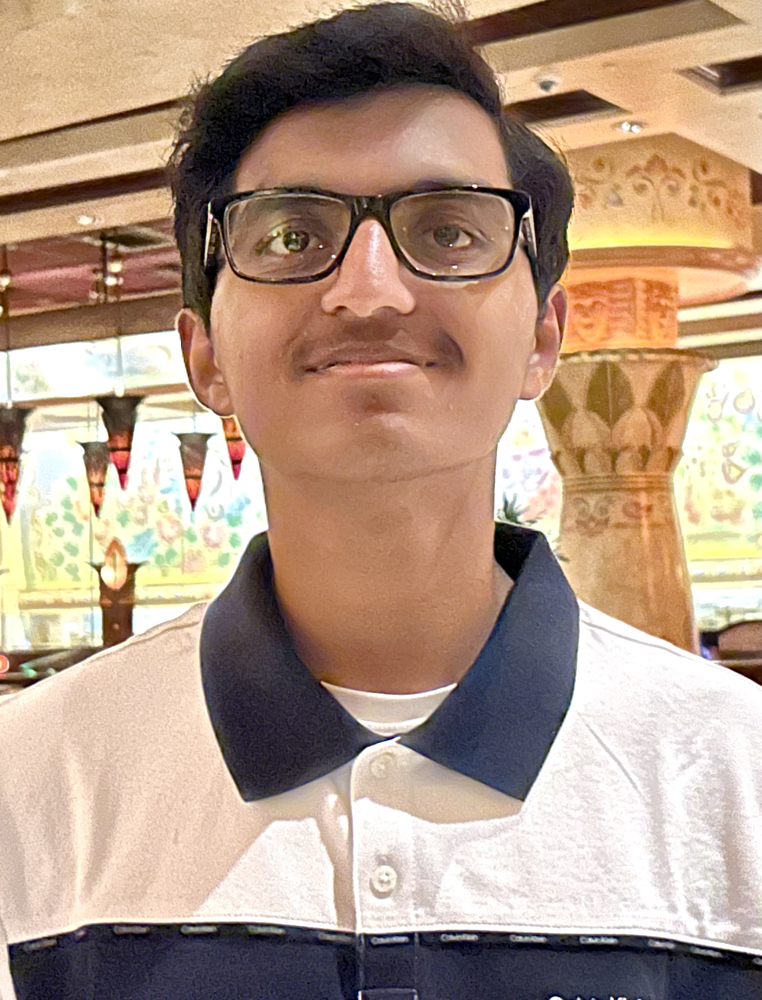
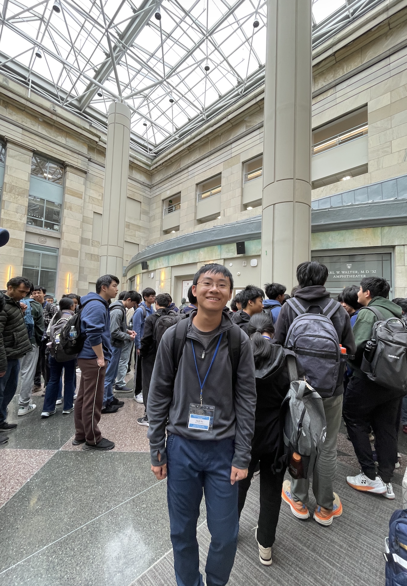

---
format:
  html:
    knitr:
      opts_chunk:
        out.width: '50%'
---

```{r setup, include=FALSE}
knitr::opts_chunk$set(echo = FALSE)
```

# Preceptor

## David Kane

```{r}
knitr::include_graphics("images/david_kane.png")
```

[David Kane](https://www.davidkane.info) is the former Preceptor in Statistical Methods and Mathematics in the Department of Government at Harvard University.


# Head Teaching Fellows

## Aadhira Satheesh

```{r}
knitr::include_graphics("images/aadhira.png")
```

[Aadhira Satheesh](https://github.com/aadhira12) (aadhira.satheesh.12 at gmail.com) will attend Exeter this fall, with interest in mathematics, computer science and health care.

## Anish Talla

```{r}
knitr::include_graphics("images/talla.jpg")
```

[Anish Talla](https://github.com/anishtalla27) (anish.talla99 at gmail.com) is a junior at Lightridge High School with an interest in software and mechanical engineering.

# Senior Teaching Fellows

## Sophia Yao

```{r}
knitr::include_graphics("images/syao.jpg")
```

[Sophia Yao](https://github.com/sophiay14) (sophia.jiani.yao at gmail.com) is a sophomore at Abbey Park High School with interests in music and electrical engineering.


## Sruthi Gandhi

```{r}
knitr::include_graphics("images/sgandhi.jpg")
```

[Sruthi Gandhi](https://github.com/sruthigandhi)(sruthi.gandhi at outlook.com) recently graduated from Ryle High School with an interest in computer science, machine learning, and data science.

## Aaditya Gupta

```{r}

```

[Aaditya Gupta](https://github.com/AadityaG2011) (aadi10may@gmail.com) is a sophomore at Rocklin High School with an interest in computer science, mathematics, and business.

## Jack Xu

```{r}

```

[Jack Xu](https://github.com/jackxu3) (bluebird.jack.xu at gmail.com) is a rising 9th grader at Mira Costa High School with interests in math, coding, artificial intelligence, physics, and swimming.

# Teaching Fellows

## Satvika Upperla

```{r}
knitr::include_graphics("images/satvika.jpeg")
```

[Satvika Upperla](https://github.com/USATVIKA) (upperlasatvika@gmail.com) is a senior at Allen High School with an interest in environmental science, data science, machine learning, and just about anything honestly. 
